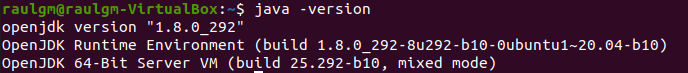

# Instalación del IDE Netbeans-8

NetBeans es un IDE popular para desarrollar aplicaciones Java.


## Como instalarlo

###### 1 ➤ Primero debemos verificar nuestra versión de java ya que debemos tenerlo instalado para para poder instalar netbeans.

```bash

java -version

```



###### 2 ➤ Ahora debemos descargar la versión jdk-8u111-nb-8_2-linux-x64.sh y aceptar las licencias.  
↳ https://www.oracle.com/technetwork/java/javase/downloads/jdk-netbeans-jsp-3413139-esa.html

###### 3 ➤ Posteriormenente desde la terminal accederemos a la carpeta donde tenemos instalado el NetBeans IDE 
###### 4 ↳ Y añadiremos los comandos
```bash

chmod +x jdk-8u111-nb-8_2-linux-x64.sh
./jdk-8u111-nb-8_2-linux-x64.sh

```


